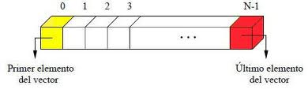

# Clase #7 - Arreglos o vectores

En esta clase veremos los arreglos o vectores.

Los vectores o arrays o arreglos de una dimensión (como los quieras llamar), son utilizados para almacenar múltiples valores en una única variable. En un aspecto más profundo, este tipo de arrays (vectores), permiten almacenar muchos valores en posiciones de memoria continuas, lo cual permite acceder a un valor u otro de manera rápida y sencilla. Estos valores pueden ser números, letras o cualquier tipo de variable que deseemos incluso tipos de datos complejos.

## Estructura



En la imagen podemos observar como es la estructura de los arreglos, estos estan compuesto por cada espacio que es donde se almacenara dicho valor y cada valor tendra un indice que lo acompaña. 

👀 Todo arreglo inicia en **0**

Veamos como lo podemos trabajar

```cpp
int vector[] = {2,1,4,6,3,7}; //valores pre-definidos
int arreglo[4]; //arreglo definido
```
**Pregunta:** Cual es la longitud del arreglo?

**Respuesta:** La longitud es de 6

**Pregunta:** Cual es el indice maximo?

**Respuesta:** 5.

**Pregunta:** Por qué?

**Respuesta:** Porque el arreglo inicia en 0 y si contamos cada valor llegariamos a 5. Lo pondre mas facil, longitud - 1 (6-1) = 5 

Veamos un ejemplo de como obtener los valores de cada uno de las posiciones del arreglo.

```cpp
int vector[] = {2,1,4,6,3,7};

cout << "indice 3: " << vector[3]; //output: 6
cout << "indice 0: " << vector[0]; //output: 2
cout << "indice 1: " << vector[1]; //output: 1
cout << "indice 5: " << vector[5]; //output: 7
```

Para obtener los valores solo hay que indicarle el indice entre los corchetes `[]` y de esa forma obtendremos el valor.

Veamos un ejemplo de como insertar los valores en el arreglo
```cpp
int vector[2];

cout << "Agregue su valor: ";
cin >> vector[0];

cout << "Agregue su valor: ";
cin >> vector[1];

cout << "Agregue su valor: ";
cin >> vector[2];
```

**Pregunta:** No se ve muy repetitivo todo? 🤔

**Respuesta:** En realidad si, y para eso entonces usemos los ciclos o bucles.

Usando el ciclo `for` podemos recorrer todo el arreglo sin la necesidad de escribir todo de manera manual.

```cpp
int vector[] = {3,5,0,6,9};
	
for(int i = 0; i<5; i++) {
  cout << "Index [" << i << "]: " << vector[i] << endl;
}
//ouput: Index[0]: 3
//ouput: Index[1]: 5
//ouput: Index[2]: 0
//ouput: Index[3]: 5
//ouput: Index[4]: 9
```

Aplicando lo mismo con los ciclos o bucles, agreguemos nuevos valores al arreglo

```cpp
int vector[5];
	
for(int i=0; i<6; i++) {
  cout << "Ingrese valor [" << i << "]: ";
  cin >> vector[i];
}
```

En caso que quisieramos trabajar con arreglos de manera dinamica podemos definirlo despues de saber la cantidad de elementos necesitamos.

```cpp
int index; 

cout << "Ingrese cantidad de elementos: ";
cin >> index;

int vector[index];
	
for(int i=0; i<index; i++) {
  cout << "Ingrese valor [" << i << "]: ";
  cin >> vector[i];
}
```

Para finalizar, si queremos actualizar algun valor solo debemos indicar la posicion y pasar el valor nuevo.

```cpp
int vector[] = {3, 5, 1};
	
vector[2] = 7;

for(int i = 0; i<3; i++) {
  cout << "Index [" << i << "]: " << vector[i] << endl;
}
//ouput: Index[0]: 3
//ouput: Index[1]: 5
//ouput: Index[2]: 7
```