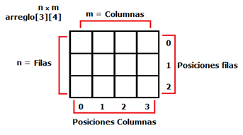

# Clase #8 - Matrices

En esta clase veremos las matrices

Las matrices o como algunos las llaman "arreglos multidimensionales" son una estructura de datos bastante similar a los vectores o arreglos. De hecho, una matriz no es más que una serie de vectores contenidos uno en el otro (u otros), es decir, una matriz es un vector cuyas posiciones son otros vectores

## Estructura



En la imagen podemos observar como es la estructura de las matrices, estas están compuesta por cada espacio que es donde se almacenara dicho valor y cada valor tendrá un índice que lo acompaña.

👀 Todo matriz inicia en **0,0** (no son ojos, son dos ceros)

Veamos como lo podemos trabajar.

```cpp
int matriz[3][3]; //matriz definida
int matriz[][] = { {1,2,3}, {5,7,9}, {9,3,1} }; //matriz definida
```

Veamos un ejemplo de como obtener los valores de cada uno de las posiciones del arreglo.

```cpp
int matriz[][] = { {1,2,3}, {5,7,10}, {9,3,1} }; //matriz definida

cout << "indice 0,0: " << vector[0][0]; //output: 1
cout << "indice 2,1: " << vector[2][1]; //output: 9
cout << "indice 1,2: " << vector[1][3]; //output: 10
cout << "indice 2,2: " << vector[2][2]; //output: 1
```

Para obtener los valores solo hay que indicarle el indice entre los corchetes `[][]` y de esa forma obtendremos el valor.

Veamos un ejemplo de cómo insertar los valores en el arreglo.

```cpp
int matriz[1][1];

cout << "Agregue su valor: ";
cin >> vector[0][0];

cout << "Agregue su valor: ";
cin >> vector[0][1];

cout << "Agregue su valor: ";
cin >> vector[1][0];

cout << "Agregue su valor: ";
cin >> vector[1][1];
```

**Pregunta:** No se ve muy repetitivo todo? 🤔

**Respuesta:** En realidad si, y para eso entonces usemos los ciclos o bucles.

Usando el ciclo `for` podemos recorrer todo el arreglo sin la necesidad de escribir todo de manera manual.

```cpp
int matriz[][] = { {1,2}, {5,7} }; 

for (int i=0; i 2; i++ ) {
		for(int j=0; j<2; j++) {
			cout << "Posicion [" << i << "] [" << j << "]: " << matriz[i][j] << "\t";
		} 
		cout << "\n";
	}

//ouput: Posicion[0][0]: 3    Posicion[0][1]: 2
//ouput: Posicion[0][0]: 5    Posicion[0][1]: 7
```

Aplicando lo mismo con los ciclos o bucles, agreguemos nuevos valores al arreglo

```cpp
int matriz[1][1];
	
for (int i=0; i<1; i++ ) {
  for(int j=0; j<1; j++) {
    cout << "Posicion [" << i << "] [" << j << "]: " ;
    cin >> valor;
    matriz[i][j] = valor;
  } 
}
```
En caso que quisieramos trabajar con arreglos de manera dinamica podemos definirlo despues de saber la cantidad de elementos necesitamos.

```cpp
int index; 
cout << "Ingrese filas: ";
cin >> filas;

cout << "Ingrese columnas: ";
cin >> columnas;

int matriz[filas][columnas]; 

for (int i = 0; i < filas; i++ ) {
  for(int j=0; j < columnas; j++) {
    cout << "Posicion [" << i << "] [" << j << "]: " ;
    cin >> valor;
    matriz[i][j] = valor;
  } 
}
```
Para finalizar, si queremos actualizar algun valor solo debemos indicar la posicion y pasar el valor nuevo.

```cpp
int matriz[][] = { {1,2}, {5,7} }; 

matriz[0][1] = 3;

for (int i=0; i<2; i++ ) {
  for(int j=0; j<2; j++) {
    cout << "Posicion [" << i << "] [" << j << "]: " << matriz[i][j] << "\t";
  } 
  cout << "\n";
}

//ouput: Posicion[0][0]: 1    Posicion[0][1]: 3
//ouput: Posicion[0][0]: 5    Posicion[0][1]: 7
```